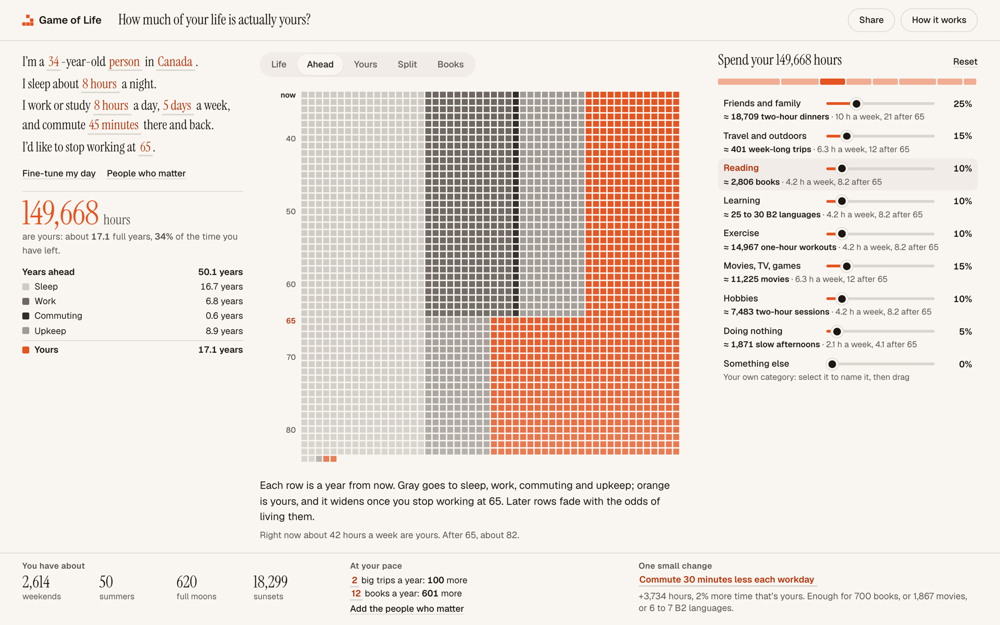

# Game of Life

How much of your life is actually yours?

**Try it:** https://choxos.github.io/game-of-life/



A remaining life budget on one screen. Describe a typical week, and the page shows the rest of your life in weeks, the hours that are yours once sleep, work, commuting and upkeep are paid for, and what those hours could hold: books, trips, dinners, languages, or doing nothing at all.

## What's on the screen

- **Your week** as a sentence to fill in, with the hours that are yours and where the rest go.
- **The week grid**, one square per week, with six zoom levels: your whole life (paler where fewer people your age are still alive), the weeks ahead sorted by what fills them, a single workday and day off in 15-minute squares, only your weeks, your weeks split by category, and one square per book, trip or movie. Hover a square to outline it and light up its group, with the details in a tooltip; the arrow keys switch levels.
- **In the weeks-ahead view**, a slider moves the age you stop working and the grid follows as you drag. Compare with someone to draw their weeks beside yours, from their link or a quick description.
- **The split**: sliders that keep the total at 100%, each row showing what its share buys and how many hours a week that means. Pick a row, a bar segment or a group in the Split view to zoom into it. The last row is yours to name.
- **Hover works everywhere there are numbers**: grid squares, split bar segments, legend rows and the counts in the band. Hovering a row, a segment or a legend entry also lights up its squares.
- **The band**: weekends, summers, full moons and sunsets left; trips and books at your pace; the people who matter; one small change and what it adds up to.
- **Dialogs** for fine-tuning your day (what counts as an obligation, phone time, time off, birthday, projected death rates), the people who matter, a share card and a weeks poster, and how it works with every number as a table.

On laptop screens and up the page fits the window with no scrolling. On phones the panels stack.

## Run it

No build step. Open `index.html`, or serve the folder:

```sh
python3 -m http.server 8000
```

Everything runs in the browser. Answers live in the page address and on this device, so a copied link restores them.

## How the numbers work

- **Headline and range**: the page leads with the age half of people like you live past. Free hours come with the range for the middle half of people like you, from living as long as the lower to the upper quartile.
- **Years ahead** is remaining life expectancy, e(x), from the UN World Population Prospects 2024 complete life tables for 2026 (medium variant), by country, sex and single year of age. It is not life expectancy at birth minus age. The spread (median and upper quartile) comes from the same tables. An option follows the UN's projected death rates year by year (cohort life expectancy) instead of holding 2026 rates fixed.
- **Time that is yours** is waking time, minus work and commuting until the age you stop working, minus daily upkeep for the rest of your life. Anything moved to "Mine" counts as free time.
- **Shared years** with another person are the expected time you are both alive, treating your chances as independent.
- **Healthy years** are rough: the WHO 2021 ratio of healthy life expectancy to life expectancy, at birth and at 60, applied to your years ahead.
- **Conversions** are alternatives, not a to-do list: reading at 238 to 260 words a minute (Brysbaert, 2019), about 500 to 600 guided learning hours to B2 (Cambridge English), 8 free hours per travel day.

## Files

| Path | What it is |
| --- | --- |
| `index.html`, `styles.css` | The page |
| `js/model.js` | The budget and life table math, no DOM |
| `js/cells.js` | The canvas week grid and its transitions |
| `js/card.js` | The share card and the weeks poster |
| `js/app.js` | Page wiring, zoom levels, sliders, dialogs |
| `data/life-tables.js` | Generated life tables |
| `scripts/build_life_tables.py` | Regenerates the data: `python3 scripts/build_life_tables.py 2026` |
| `test/model.test.js` | Model check: `node test/model.test.js` |

## Data

UN DESA, Population Division (2024). World Population Prospects 2024. CC BY 3.0 IGO.
WHO Global Health Observatory, healthy life expectancy (HALE), 2021. CC BY-NC-SA 3.0 IGO.
